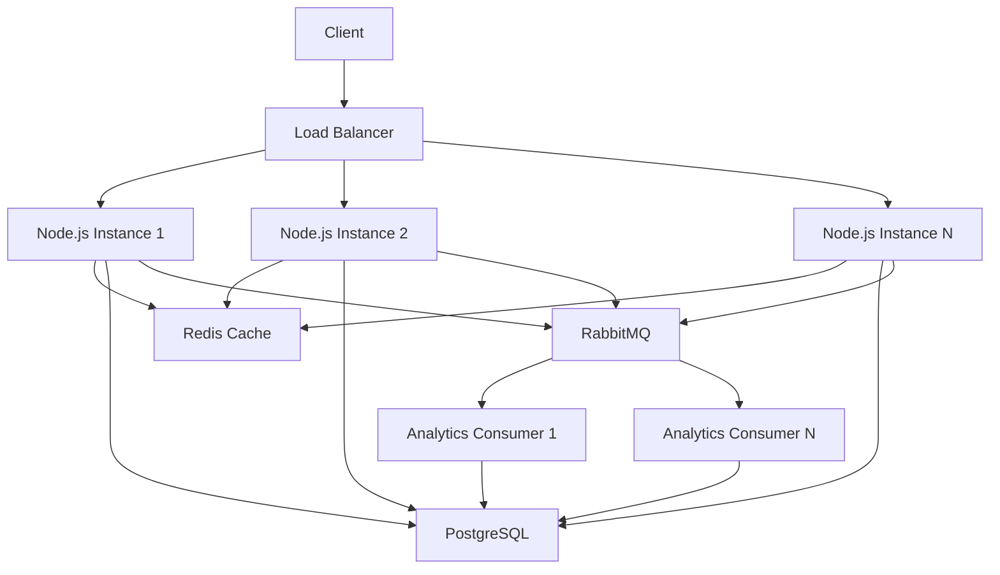
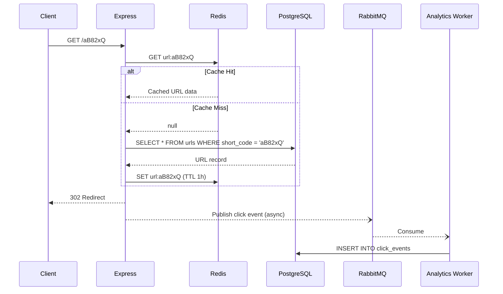
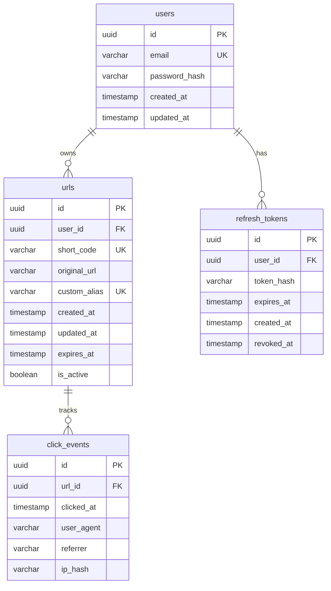

# Shortify — Production-Quality URL Shortener

A resume-worthy URL shortening service demonstrating strong backend engineering with Node.js, TypeScript, Express, PostgreSQL, Redis, and RabbitMQ.

## Overview

Shortify is a modular monolith URL shortening backend that transforms long URLs into short, shareable links. It features JWT authentication, Redis caching for fast redirects, asynchronous analytics via RabbitMQ, and comprehensive API documentation via Swagger.

## Features

- 🔗 **URL Shortening** — Generate short Base62 codes with collision-safe retry
- 🏷️ **Custom Aliases** — User-defined vanity URLs with reserved word protection
- ⏰ **URL Expiration** — Optional time-limited links
- 🚀 **Fast Redirects** — Redis cache-aside pattern with PostgreSQL fallback
- 📊 **Async Analytics** — Click tracking via RabbitMQ with dead-letter queues
- 🔐 **JWT Authentication** — Access/refresh token pairs with rotation
- 🛡️ **Rate Limiting** — Redis-backed with configurable windows per endpoint
- 📖 **Swagger/OpenAPI** — Interactive API documentation at `/docs`
- 🐳 **Docker Compose** — One-command local deployment
- ✅ **Tested** — Unit + integration tests with Jest/Supertest
- 📝 **Structured Logging** — Pino with request correlation IDs
- 🏥 **Health Checks** — Component-level health monitoring

## Architecture



### Redirect Flow



## Tech Stack

| Component | Technology |
|-----------|------------|
| Runtime | Node.js + TypeScript |
| Framework | Express.js |
| Database | PostgreSQL |
| ORM | Prisma |
| Cache | Redis (ioredis) |
| Message Broker | RabbitMQ (amqplib) |
| Authentication | JWT + bcrypt |
| Validation | Zod v4 |
| Logging | Pino |
| API Docs | Swagger/OpenAPI |
| Testing | Jest + Supertest |
| Security | Helmet, CORS |
| Containerization | Docker + Docker Compose |
| Code Quality | ESLint + Prettier |

## Project Structure

```
src/
├── config/
│   ├── env.ts              # Zod-validated environment config
│   ├── logger.ts           # Pino structured logging
│   └── swagger.ts          # OpenAPI 3.0 specification
├── infrastructure/
│   ├── database/
│   │   └── prisma.client.ts
│   ├── redis/
│   │   └── redis.client.ts # Graceful degradation wrapper
│   └── rabbitmq/
│       └── rabbitmq.client.ts # Auto-reconnect, DLQ support
├── middleware/
│   ├── auth.middleware.ts   # JWT Bearer token extraction
│   ├── error.middleware.ts  # Centralized error handling
│   ├── rateLimit.middleware.ts # Redis-backed rate limiting
│   ├── requestId.middleware.ts # X-Request-ID correlation
│   └── validate.middleware.ts  # Zod schema validation
├── modules/
│   ├── auth/
│   │   ├── auth.controller.ts
│   │   ├── auth.repository.ts
│   │   ├── auth.routes.ts
│   │   ├── auth.schemas.ts
│   │   └── auth.service.ts
│   ├── urls/
│   │   ├── redirect.routes.ts
│   │   ├── shortCode.service.ts # Base62 generation
│   │   ├── url.controller.ts
│   │   ├── url.repository.ts
│   │   ├── url.routes.ts
│   │   ├── url.schemas.ts
│   │   └── url.service.ts     # Cache-aside, collision retry
│   ├── analytics/
│   │   ├── analytics.consumer.ts  # RabbitMQ message handler
│   │   ├── analytics.controller.ts
│   │   ├── analytics.publisher.ts
│   │   ├── analytics.repository.ts # DB-side aggregation
│   │   ├── analytics.routes.ts
│   │   └── analytics.service.ts
│   └── health/
│       └── health.routes.ts
├── types/
│   └── express.d.ts
├── utils/
│   └── errors.ts           # Typed error hierarchy
├── app.ts                   # Express app factory
└── server.ts                # Entrypoint + graceful shutdown
```

## Database Schema



### Index Strategy

| Index | Purpose |
|-------|---------|
| `urls.short_code` (UNIQUE) | Fast redirect lookups — the most critical query path |
| `urls.custom_alias` (UNIQUE) | Custom alias redirect resolution |
| `urls.user_id` | List URLs by owner — used in paginated listing |
| `urls.created_at` | Sorting URLs by creation date |
| `urls.expires_at` | Future cleanup job for expired URLs |
| `urls.(is_active, expires_at)` | Composite index for filtering active/expired URLs |
| `click_events.(url_id, clicked_at)` | Analytics aggregation: COUNT + GROUP BY for a specific URL |
| `click_events.clicked_at` | Time-range filtering in analytics queries |
| `refresh_tokens.token_hash` | Fast refresh token lookup during auth refresh |
| `refresh_tokens.user_id` | Revoking all tokens for a user on logout |

## Authentication

- **Registration**: Email + password (bcrypt, 12 rounds)
- **Login**: Returns short-lived access token (JWT, 15min) + long-lived refresh token (80 random hex chars, 7 days)
- **Refresh Token Rotation**: Each refresh invalidates the previous token, preventing replay
- **Token Storage**: Refresh tokens are SHA-256 hashed before storage — if the database is compromised, raw tokens are not exposed
- **Logout**: Revokes the refresh token

## URL Shortening Algorithm

### Base62 Encoding

Uses the character set `a-zA-Z0-9` (62 characters). Codes are 7 characters long by default.

**Possible combinations**: 62^7 = **3,521,614,606,208** (~3.5 trillion)

### Collision Probability

With random generation, the probability of a collision follows the Birthday Paradox. Even with 1 million URLs, the collision probability per new URL is approximately:

```
P(collision) = n / (62^7) ≈ 1,000,000 / 3,521,614,606,208 ≈ 0.000028%
```

### Why Database Constraints Are Still Required

Statistical rarity does not guarantee uniqueness under:
- **Concurrent requests**: Two servers generating the same code simultaneously
- **PRNGs with shared seeds**: Unlikely with `crypto.randomBytes()` but still a defense-in-depth concern
- **Scale**: At billions of URLs, collision probability increases

The `UNIQUE` constraint on `short_code` is the **ultimate source of truth**. The application detects constraint violations (Prisma error P2002) and retries with a new code, up to 5 times.

### Concurrent Request Behavior

```
Request A: generate "aB82xQ" → INSERT → SUCCESS
Request B: generate "aB82xQ" → INSERT → UNIQUE VIOLATION → generate "xK9mPz" → INSERT → SUCCESS
```

The database serializes insertions, so only one request "wins" for a given code. The retry mechanism ensures the losing request still succeeds with a different code.

## Redis Caching

### Cache-Aside Pattern

1. **Cache Hit**: Return cached URL data immediately
2. **Cache Miss**: Query PostgreSQL → Populate Redis → Return data
3. **Write-Through Invalidation**: On URL update/delete/deactivate → Delete cache entry

### TTL Strategy

- Default TTL: **1 hour**
- If a URL has an expiration date, the cache TTL is `min(1 hour, time_until_expiry)`
- The database record is **always authoritative** — cached data is re-validated for expiration

### Cache Invalidation

URLs are invalidated from cache when:
- Updated (original URL or isActive changed)
- Deleted
- Deactivated

Both `shortCode` and `customAlias` cache keys are invalidated.

### Redis Failure Behavior

If Redis becomes unavailable:
- **Redirects**: Fall back to PostgreSQL lookups (slower but functional)
- **Rate limiting (auth)**: Fail **closed** (deny requests) — security takes priority
- **Rate limiting (other)**: Fail **open** (allow requests) — availability takes priority
- **Cache writes**: Silently fail (logged as warnings)

The application never crashes due to Redis unavailability.

## RabbitMQ Analytics

### Asynchronous Processing

Click events are published to RabbitMQ **after** the redirect response is sent. This ensures:
- Redirect latency is not affected by database writes
- Analytics processing can be scaled independently
- Temporary database slowdowns don't impact user experience

### Dead-Letter Queue

Failed messages (after 3 retries) are sent to `analytics.clicks.dlq` for manual inspection. Messages have a 24-hour TTL.

### Failure Behavior

If RabbitMQ is unavailable:
- The redirect still succeeds (302 response sent)
- The analytics event is **lost** (logged as a warning)
- This is an explicit trade-off: **redirect availability > analytics completeness**
- Analytics are eventually consistent by design

## Rate Limiting

Redis-backed fixed-window rate limiter with configurable limits per endpoint category:

| Endpoint | Window | Max Requests | Failure Mode |
|----------|--------|-------------|--------------|
| Auth (register/login) | 15 min | 10 | Fail **closed** |
| URL creation | 1 min | 20 | Fail **open** |
| General API | 1 min | 100 | Fail **open** |

Rate limit headers are returned on every response:
- `X-RateLimit-Limit`
- `X-RateLimit-Remaining`
- `X-RateLimit-Reset`

## Security

- **Helmet**: HTTP security headers
- **CORS**: Configurable origin whitelist
- **bcrypt**: Password hashing (12 rounds)
- **JWT Validation**: Signature + expiration verification
- **Zod Validation**: All inputs validated before processing
- **URL Protocol Restriction**: Only `http://` and `https://` allowed
- **Parameterized Queries**: Prisma prevents SQL injection
- **Error Sanitization**: Stack traces never exposed in production
- **Secret Redaction**: Passwords and tokens never logged
- **IP Hashing**: SHA-256 truncated hash for privacy-conscious analytics
- **Refresh Token Hashing**: Stored as SHA-256 digests

> **Note**: URL validation prevents dangerous protocols (`javascript:`, `data:`, `file:`) but cannot prevent phishing or malicious content at the destination. This is a fundamental limitation of URL shortening services.

## Concurrency

### URL Creation
Two requests generating the same short code are handled by the database UNIQUE constraint + application retry logic. See "Concurrent Request Behavior" above.

### Redirect + Deletion Race
If a URL is deleted while a redirect is in progress, the redirect may still succeed (cached data). This is acceptable — the cache entry will expire or be invalidated.

### Cache Invalidation
Cache invalidation happens synchronously during URL mutations. A small window exists where stale data may be served (between the database update and cache delete). This is a standard trade-off in cache-aside patterns and is bounded by the TTL.

## Error Handling

All errors follow a consistent format:

```json
{
  "success": false,
  "error": {
    "code": "URL_NOT_FOUND",
    "message": "The requested short URL does not exist"
  },
  "timestamp": "2026-08-28T00:00:00.000Z",
  "path": "/abc123",
  "requestId": "550e8400-e29b-41d4-a716-446655440000"
}
```

Error codes are typed enums — consumers can safely switch on `error.code`.

## API Documentation

Interactive Swagger UI available at: `http://localhost:8080/docs`

### API Routes

| Method | Path | Auth | Description |
|--------|------|------|-------------|
| POST | `/api/v1/auth/register` | ❌ | Register a new user |
| POST | `/api/v1/auth/login` | ❌ | Login and get tokens |
| POST | `/api/v1/auth/refresh` | ❌ | Refresh access token |
| POST | `/api/v1/auth/logout` | ❌ | Revoke refresh token |
| POST | `/api/v1/urls` | ✅ | Create a short URL |
| GET | `/api/v1/urls` | ✅ | List your URLs (paginated) |
| GET | `/api/v1/urls/:id` | ✅ | Get URL details |
| PUT | `/api/v1/urls/:id` | ✅ | Update a URL |
| DELETE | `/api/v1/urls/:id` | ✅ | Delete a URL |
| GET | `/api/v1/urls/:id/analytics` | ✅ | Get analytics summary |
| GET | `/api/v1/urls/:id/analytics/daily` | ✅ | Get daily click breakdown |
| GET | `/:shortCode` | ❌ | Redirect to original URL |
| GET | `/health` | ❌ | Health check |
| GET | `/docs` | ❌ | Swagger UI |

## Running Locally

### Prerequisites

- Node.js 20+
- Docker & Docker Compose

### Quick Start

```bash
# Clone and install
git clone <repo>
cd shortify
npm install
npx prisma generate

# Start infrastructure
docker compose up -d postgres redis rabbitmq

# Run migrations
npx prisma migrate deploy

# Start development server
npm run dev
```

### Using Docker Compose (Full Stack)

```bash
docker compose up --build
```

This starts PostgreSQL, Redis, RabbitMQ, and the Node.js application. The API is available at `http://localhost:8080`.

## Docker Setup

The `Dockerfile` uses a multi-stage build:
1. **Builder stage**: Compiles TypeScript
2. **Production stage**: Runs with `node:20-alpine`, non-root user, and `dumb-init` for signal handling

Migrations are applied automatically on container start.

## Environment Variables

See [.env.example](.env.example) for all configuration options. Key variables:

| Variable | Description | Default |
|----------|-------------|---------|
| `PORT` | Server port | `8080` |
| `BASE_URL` | Public base URL for short links | `http://localhost:8080` |
| `DATABASE_URL` | PostgreSQL connection string | required |
| `REDIS_URL` | Redis connection string | required |
| `RABBITMQ_URL` | RabbitMQ connection string | required |
| `JWT_ACCESS_SECRET` | JWT signing secret (min 16 chars) | required |
| `JWT_REFRESH_SECRET` | Refresh token signing secret | required |
| `JWT_ACCESS_EXPIRY` | Access token lifetime | `15m` |
| `JWT_REFRESH_EXPIRY` | Refresh token lifetime | `7d` |
| `RATE_LIMIT_AUTH_*` | Auth rate limiting config | see .env.example |

## Running Tests

```bash
# Unit tests (no infrastructure required)
npm run test:unit

# Integration tests (requires PostgreSQL, Redis, RabbitMQ)
docker compose up -d postgres redis rabbitmq
npx prisma migrate deploy
npm run test:integration

# All tests with coverage
npm run test:coverage
```

## Load Testing

A k6 load test script is provided in `k6/load-test.js`:

```bash
# Install k6: https://k6.io/docs/getting-started/installation/
k6 run --env BASE_URL=http://localhost:8080 --env SHORT_CODE=<your-code> k6/load-test.js
```

Measures:
- Redirect throughput (requests/second)
- p95/p99 latency
- Error rate under concurrent load

## Scalability

### Horizontal Scaling

The application is designed to run behind a load balancer with multiple Node.js instances:

- **No in-memory state**: All state lives in PostgreSQL/Redis
- **Redis**: Shared cache across all instances
- **PostgreSQL**: Handles concurrent writes via UNIQUE constraints
- **RabbitMQ**: Distributes analytics processing across multiple consumers

### Scaling Components

| Component | Scaling Strategy |
|-----------|-----------------|
| Node.js | Add instances behind load balancer |
| PostgreSQL | Read replicas for analytics queries |
| Redis | Redis Cluster or Redis Sentinel |
| RabbitMQ | Add consumer instances for throughput |
| Click Events | Partition by URL ID or time range |

### Future Improvements

- **CDN/Edge Caching**: Cache redirects at the edge for global performance
- **Database Partitioning**: Partition `click_events` by month for efficient archival
- **Connection Pooling**: PgBouncer for high-connection environments
- **Distributed Rate Limiting**: Token bucket with Redis Lua scripts
- **Observability**: Prometheus metrics, distributed tracing (OpenTelemetry)
- **URL Previews**: Link unfurling for social media sharing
- **Bulk URL Import**: CSV upload for migrating from other services

## Design Trade-offs

| Decision | Why | Alternative Considered |
|----------|-----|----------------------|
| **PostgreSQL over MongoDB** | ACID transactions, strong typing, efficient COUNT/GROUP BY for analytics, UNIQUE constraints | MongoDB — flexible schema but weaker transactions |
| **Redis for caching** | Sub-millisecond lookups, built-in TTL, mature ecosystem | In-memory Map — can't share across instances |
| **RabbitMQ for analytics** | Reliable delivery, dead-letter queues, independent consumer scaling | Direct database writes — would add latency to redirects |
| **Base62 random codes** | URL-safe, no sequential ID exposure, compact | UUID — too long for URLs. Sequential — guessable |
| **HTTP 302 over 301** | Allows URL updates, analytics tracking, deactivation | 301 — cached by browsers, prevents future tracking |
| **Modular monolith** | Simpler deployment, no network overhead, clear module boundaries | Microservices — unnecessary complexity for this scale |
| **Async analytics** | Fast redirects, independent scaling | Sync writes — redirect latency includes DB write |
| **Cache-aside over write-through** | Simpler invalidation, DB remains source of truth | Write-through — more complex, potential cache stampede |
| **Refresh token rotation** | Limits damage from token theft | Long-lived tokens — higher risk if compromised |
| **IP hashing** | Privacy-conscious visitor counting | Raw IP storage — GDPR/privacy concerns |

### What Happens If Redis Fails?

Redirects fall back to PostgreSQL. Auth rate limiting fails closed (denies requests). URL creation rate limiting fails open (allows requests). Cache operations log warnings and silently fail. The application remains functional.

### What Happens If RabbitMQ Fails?

Redirects still work. Analytics events for the downtime period are lost (logged). This is an explicit trade-off documented in the code. When RabbitMQ recovers, new events are processed normally. The client auto-reconnects up to 10 times.

### Why is Analytics Eventually Consistent?

Because analytics events are processed asynchronously through RabbitMQ, there is a brief delay between a redirect and the click appearing in analytics queries. This is the trade-off for keeping redirect latency low. The delay is typically sub-second under normal load.

### How Are Collisions Handled?

The application generates a random Base62 code, attempts insertion, and if the UNIQUE constraint is violated, generates a new code and retries (up to 5 times). The database is the ultimate arbiter of uniqueness, not the application.
